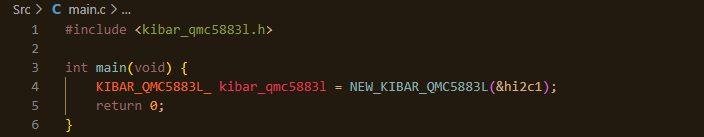
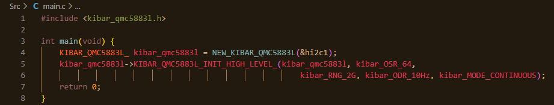
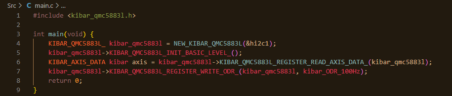
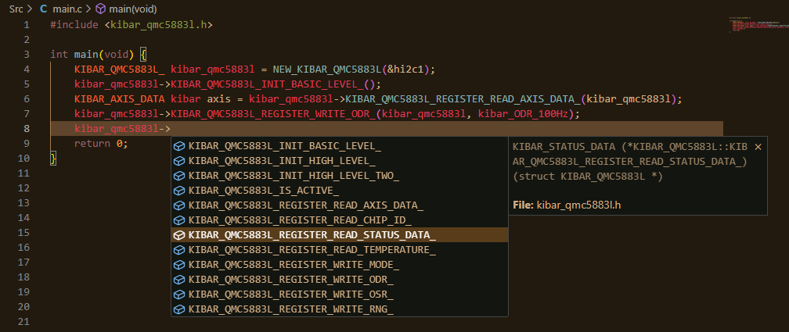

# KIBAR_STM32_QMC5883L_MULTI_CHIP_DRIVER
[EN]This is a QMC5883L multi-chip driver developed to support all STM32XXXX microcontrollers and boards based on the HAL library. It supports all features of the QMC5883L multi-chip.

<strong>Question</strong>: <em>How to Use Kibar QMC5883L multi-chip Driver?</em>

Kibar QMC5883L multi-chip driver, like all Kibar drivers, requires the creation of a KIBAR structure. In the QMC5883L multi-chip driver, this is referred to as KIBAR_QMC5883L_ (The KIBAR_QMC5883L structure is created with a reference to the I2C peripheral unit to which it is connected.).

To activate the Kibar QMC5883L multi-chip driver, a constructor function, as with all Kibar drivers, must be used. In this driver, this function is called using NEW_KIBAR_QMC5883L. An example usage is shown below:

After activating the Kibar QMC5883L multi-chip driver, the chip itself must be activated directly. This is done using initialization functions. There are three types of init functions:

- `KIBAR_STATUS KIBAR_QMC5883L_INIT_BASIC_LEVEL_`
- `KIBAR_STATUS KIBAR_QMC5883L_INIT_HIGH_LEVEL_`
- `KIBAR_STATUS KIBAR_QMC5883L_INIT_HIGH_LEVEL_TWO_`

The `KIBAR_QMC5883L_INIT_BASIC_LEVEL_` function initializes the driver with the general configuration described in the QMC5883L datasheet. This function does not take any parameters. If you want a quick start, you can use this function directly.

The `KIBAR_QMC5883L_INIT_HIGH_LEVEL_` function allows you to configure the settings yourself but automatically determines the value written to the SET/RESET PERIOD register for safety purposes.

The `KIBAR_QMC5883L_INIT_HIGH_LEVEL_TWO_` function allows you to configure all settings except for registers reserved by the chip manufacturer. However, note that entering `0x01` into the SET/RESET PERIOD register for safety reasons is the most suitable choice.

An example usage is shown below:

When using the functions of the Kibar QMC5883L multi-chip driver, you need to provide the created structure as a parameter. If the structure is for a read feature, no additional parameters are needed. However, if it is for a write feature, you need to provide parameters such as KIBAR_OSR, KIBAR_RNG, KIBAR_ODR, KIBAR_MODE, and some data values. An example is shown below:

Like all KIBAR drivers, the KIBAR_QMC5883L_MULTI_CHIP driver returns a value of type `KIBAR_STATUS` for all features except for specific functions that are designed to return specific values. If your code is not working, you can verify whether the QMC5883L structure is functioning correctly by checking the KIBAR_STATUS value.

You can now access functions through the structure's own properties. An example is provided below:

Remember that some functions return specific data types such as `KIBAR_AXIS_DATA`, `KIBAR_STATUS_DATA`, `KIBAR_QMC5883L_TEMPERATURE`, and `KIBAR_QMC5883L_CHIP_ID`. You should write these functions' outputs to objects of these data types.

Additionally, some points to remember are:

- After a power cycle (POR) or a software reset, the entire system will return to factory settings and enter standby mode, turning off all parts except for some registers and internal structures. In this case, you need to reconfigure the chip, meaning you should call the init function, but there's no need to call the driver creation function again.

- The `KIBAR_QMC5883L_REGISTER_READ_CHIP_ID_` function should return `0xFF` when operating correctly. If you suspect an issue, call the `KIBAR_QMC5883L_IS_ACTIVE_` function.

- By default, the interrupt function is enabled while the Roll-Pointer function is disabled.

<strong>Question</strong>: <em>Why am I getting "kibar_ERROR" as the return value?</em>

The probable cause of your issue is either incorrect connections or a synchronization problem between the master and slave devices. Check your connections. If you are sure the connections are correct, perform a power cycle on the devices, reset both devices (for QMC5883L drive, ), and toggle the SCL line nine times.

# KIBAR_STM32_QMC5883L_MULTI_CHIP_DRIVER
[TR]Bu KIBAR sürücüsü, HAL kitaplığını temel alan tüm STM32XXXX mikro denetleyicilerini ve kartlarını desteklemek için geliştirilmiş bir QMC5883L çoklu yonga sürücüsüdür. QMC5883L çoklu yongasının tüm özelliklerini destekler.

<strong>Soru</strong>: <em>Kibar QMC5883L çoklu yonga Sürücüsü Nasıl Kullanılır?</em>

Kibar QMC5883L çoklu yonga sürücüsü, tüm Kibar sürücüleri gibi KIBAR yapısının oluşturulmasını gerektirir. QMC5883L çoklu yonga sürücüsünde bu KIBAR_QMC5883L_ adı ile refere edilmiştir (KIBAR_QMC5883L yapısı, bağlı olduğu I2C çevre birimine referansla oluşturulur.).

Kibar QMC5883L çoklu yonga sürücüsünü aktif hale getirmek için tüm Kibar sürücülerinde olduğu gibi bir yaratıcı fonksiyonunun kullanılması gerekmektedir. Bu sürücüde bu işlev NEW_KIBAR_QMC5883L şeklinde refere edilmiştir. Örnek bir kullanım aşağıda gösterilmektedir:

Kibar QMC5883L çoklu yonga sürücüsünü etkinleştirdikten sonra yonganın kendisinin doğrudan etkinleştirilmesi gerekir. Bu kısım, Init işlevleri kullanılarak yapılır. Üç tür Init işlevi vardır:

- `KIBAR_STATUS KIBAR_QMC5883L_INIT_BASIC_LEVEL_`
- `KIBAR_STATUS KIBAR_QMC5883L_INIT_HIGH_LEVEL_`
- `KIBAR_STATUS KIBAR_QMC5883L_INIT_HIGH_LEVEL_TWO_`

'KIBAR_QMC5883L_INIT_BASIC_LEVEL_' işlevi, sürücüyü QMC5883L veri sayfasında açıklanan genel konfigürasyonla başlatır. Bu fonksiyon herhangi bir parametre almaz. Hızlı bir başlangıç ​​yapmak istiyorsanız bu işlevi doğrudan kullanabilirsiniz.

KIBAR_QMC5883L_INIT_HIGH_LEVEL_` işlevi, ayarları kendiniz yapılandırmanıza olanak tanır ancak güvenlik amacıyla SET/RESET PERIOD registerının değerini otomatik olarak belirler.

'KIBAR_QMC5883L_INIT_HIGH_LEVEL_TWO_' işlevi, yonga üreticisi tarafından rezerve edilen registerlar dışındaki tüm ayarları yapılandırmanıza olanak tanır. Ancak güvenlik nedeniyle SET/RESET PERIOD kaydına '0x01' girmenin en uygun seçim olduğunu unutmayın.

Örnek bir kullanım aşağıda gösterilmektedir:

Kibar QMC5883L çoklu yonga sürücüsünün fonksiyonlarını kullanırken oluşturulan yapıyı parametre olarak vermeniz gerekmektedir. Yapı bir okuma özelliğine yönelikse ek parametreye gerek yoktur. Ancak yazma özelliği için ise KIBAR_OSR, KIBAR_RNG, KIBAR_ODR, KIBAR_MODE gibi parametreleri ve bazı veri değerlerini sağlamanız gerekmektedir. Aşağıda bir örnek gösterilmiştir:

Tüm KIBAR sürücüleri gibi, KIBAR_QMC5883L_MULTI_CHIP sürücüsü de belirli değerleri döndürmek üzere tasarlanmış belirli işlevler dışındaki tüm özellikler için "KIBAR_STATUS" türünde bir değer döndürür. Kodunuz çalışmıyorsa KIBAR_STATUS değerini kontrol ederek QMC5883L yapısının düzgün çalışıp çalışmadığını doğrulayabilirsiniz.

Artık işlevlere yapının kendisi aracılığıyla erişebilirsiniz. Aşağıda bir örnek verilmiştir:

Bazı işlevlerin "KIBAR_AXIS_DATA", "KIBAR_STATUS_DATA", "KIBAR_QMC5883L_TEMPERATURE" ve "KIBAR_QMC5883L_CHIP_ID" gibi belirli veri türlerini döndürdüğünü unutmayın. Bu fonksiyonların çıktılarını bu veri tipindeki nesnelere yazmalısınız.

Ayrıca unutulmaması gereken bazı noktalar şunlardır:

- Güç döngüsünden (POR) veya yazılım sıfırlamasından sonra tüm sistem fabrika ayarlarına dönecek ve bekleme moduna girecek, bazı registerlar ve iç yapılar hariç tüm parçaları kapatacaktır. Bu durumda yongayı yeniden yapılandırmanız gerekir; bu, Init işlevini çağırmanız gerektiği anlamına gelir, ancak sürücü yaratıcı işlevini yeniden çağırmanıza gerek yoktur.

- `KIBAR_QMC5883L_REGISTER_READ_CHIP_ID_` işlevi doğru çalıştığında `0xFF` döndürmelidir. Bir sorundan şüpheleniyorsanız `KIBAR_QMC5883L_IS_ACTIVE_` işlevini çağırın.

- Varsayılan olarak, Roll-Pointer işlevi devre dışıyken Kesme işlevi etkindir.
